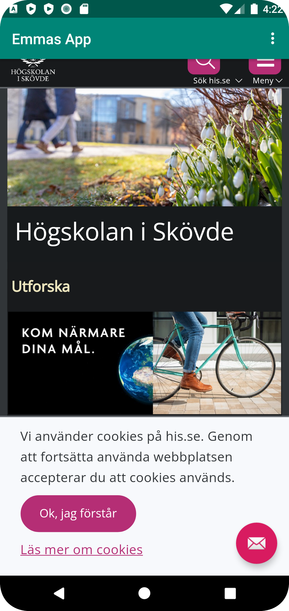
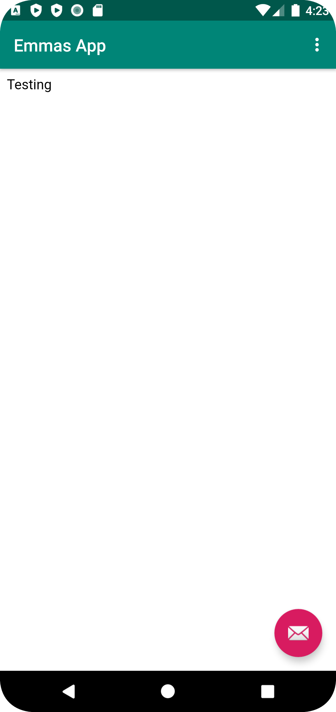

# Rapport

**Skriv din rapport här!**

_Du kan ta bort all text som finns sedan tidigare_.

## Följande grundsyn gäller dugga-svar:

- Ett kortfattat svar är att föredra. Svar som är längre än en sida text (skärmdumpar och programkod exkluderat) är onödigt långt.
- Svaret skall ha minst en snutt programkod.
- Svaret skall inkludera en kort övergripande förklarande text som redogör för vad respektive snutt programkod gör eller som svarar på annan teorifråga.
- Svaret skall ha minst en skärmdump. Skärmdumpar skall illustrera exekvering av relevant programkod. Eventuell text i skärmdumpar måste vara läsbar.
- I de fall detta efterfrågas, dela upp delar av ditt svar i för- och nackdelar. Dina för- respektive nackdelar skall vara i form av punktlistor med kortare stycken (3-4 meningar).


```
   <WebView
        android:id="@+id/my_webview"
        android:layout_width="match_parent"
        android:layout_height="match_parent" />
```
Kod för att skapa ett Webview-element med ett ID


```
public class MainActivity extends AppCompatActivity {
    WebView myWebView;
    ...
    @Override
    protected void onCreate(Bundle savedInstanceState) {
        ...
        myWebView = findViewById(R.id.my_webview);
        myWebView.getSettings().setJavaScriptEnabled(true);
        myWebView.setWebViewClient(new WebViewClient());
```

```
public class MainActivity extends AppCompatActivity {
    public void showInternalWebPage(){
        myWebView.loadUrl("file:///android_asset/about.html");
    }
    public void showmin_egna_hemsida(){
        myWebView.loadUrl("https://wwwlab.iit.his.se/b21emmbj/webbplats/SVG/");
    }
    ...
      public boolean onOptionsItemSelected(MenuItem item) {
            int id = item.getItemId();
            if (id == R.id.action_external_web) {
                Log.d("==>","Will display external web page");
                showExternalWebPage();
                return true;
            }
            if (id == R.id.action_internal_web) {
                Log.d("==>","Will display internal web page");
                showInternalWebPage();
                return true;
            }
```
Externa hemsidan:

Intern hemsida:


